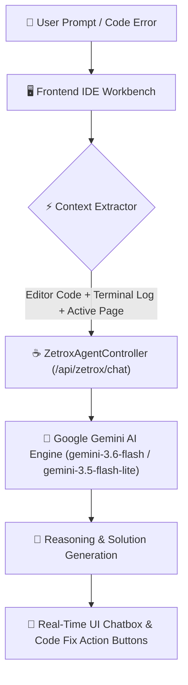

<div align="center">

# 🚀 Let's Code Together — Interactive Developer & Learning Platform

### _Full-Stack Interactive IDE, Multi-Language Compiler, 3D Visualizer, Zetrox AI Agent & Code Mentor_

[](https://spring.io/projects/spring-boot)
[](https://openjdk.org/)
[](https://ai.google.dev/)
[](https://www.mysql.com/)
[](https://www.docker.com/)
[](https://render.com/)
[](LICENSE)

<br/>

**Learn · Code · Compile · Visualize · Pair Program · Zetrox AI Mentor — All in One Workspace**

_A next-generation, glassmorphic interactive web platform featuring an 8-language real-time online compiler, resizable IDE output console, autonomous Zetrox AI coding assistant, 3D algorithm visualizers, live collaborative code rooms, scored quizzes, and real-time community chat._

<br/>

[🌐 Live Platform Demo](https://lets-code-together.onrender.com) · [🐛 Report Bug](https://github.com/deepakgowrishankar7/Lets_Code_Together/issues) · [✨ Request Feature](https://github.com/deepakgowrishankar7/Lets_Code_Together/issues)

</div>

---

## 🌟 Platform Highlights & Core Capabilities

<table>
<tr>
<td width="50%">

### 🤖 Zetrox AI Agent & Code Mentor
- **Context-Aware Pair Programmer** — Multi-turn conversation synchronized with your active editor code, compiler output, and page context.
- **AI Code Mentor & Auto-Corrector** — Line-by-line syntax diagnosis, time/space complexity analysis, and 100% automated error fixes.
- **Dynamic Interactive Quizzes** — On-demand quiz generation tailored to your language and learning progress.

</td>
<td width="50%">

### ⚡ IDE Workbench & Multi-Language Compiler
- **8 Supported Languages** — Java 21, Python 3.12, GCC C++, GCC C, Node.js JavaScript, Go, Ruby, PHP, SQL RDBMS.
- **Resizable Output Splitter** — Drag handle to expand/collapse terminal console output height seamlessly.
- **Edge-to-Edge Full Screen Mode** — Maximize output console to full display for distraction-free output reading.

</td>
</tr>
<tr>
<td width="50%">

### 🎬 3D Visualizers & Live Code Rooms
- **3D Algorithm Visualizer** — Step-by-step visual execution of sorting algorithms, binary search, tree traversals, and call stacks.
- **Live Collaborative Rooms** — Instant room creation (`CT-ROOM-XXXXXX`) for real-time pair programming and technical interviews.
- **Concept Canvases** — Visual memory frames for stack, heap, and pointer operations.

</td>
<td width="50%">

### 📚 Masterclass Courses & Global Leaderboard
- **Structured Curriculum** — Comprehensive tracks for Java 21, Python 3, SQL, and DSA (Arrays, Trees, Graphs, DP).
- **Interactive Quiz Hub** — Scored assessments with category score logging and progress tracking.
- **Campus Leaderboard** — Real-time user rankings by language tier (Java Beginner/Inter/Adv, Python, SQL).

</td>
</tr>
</table>

---

## 🤖 Zetrox AI Autonomous Architecture

Zetrox AI operates directly inside the platform as a context-aware pair programmer powered by Google Gemini AI:



---

## 💻 IDE Workbench & Multi-Language Compiler

The **Let's Code Together IDE** delivers a full desktop-class coding environment inside the web browser:

| Language | Engine / Compiler Version | Execution Capabilities |
|:---|:---|:---|
| **Java** | Java 21 LTS OpenJDK | Virtual threads, record types, pattern matching, full OOP |
| **Python** | Python 3.12 | Standard libraries, algorithmic scripts, data structure handling |
| **C++** | GCC C++20 | STL containers, pointers, manual memory management |
| **C** | GCC C17 | Low-level memory, pointers, struct manipulation |
| **JavaScript** | Node.js v18+ | ES6 Async/Await, JSON parsing, algorithmic problems |
| **Go** | Go 1.22+ | Goroutines, channels, fast compilation |
| **Ruby** | Ruby 3.x | Object-oriented scripts, string manipulation |
| **PHP** | PHP 8.x | Command-line scripting, array processing |
| **SQL** | In-Browser RDBMS / SQLite | Interactive query engine, JOINs, GROUP BY aggregations |

---

## 🏗️ Technical Stack & Architecture

<div align="center">

### Backend Architecture
| Layer | Technologies |
|:---|:---|
| **Framework** | Spring Boot 3.5.14 |
| **Language** | Java 21 LTS |
| **AI Integration** | Google Gemini API (v1beta REST API with failover model fallback) |
| **Security** | Spring Security & JWT Token-based Authentication |
| **Database ORM** | Spring Data JPA & Hibernate 6.6 |
| **Database** | MySQL 8.0 RDBMS |
| **Mail & OTP** | Spring Mail (SMTP SSL) with Brevo & Resend HTTP Fallbacks |
| **API Docs** | SpringDoc OpenAPI (Swagger UI) |

### Frontend Architecture
| Layer | Technologies |
|:---|:---|
| **UI Framework** | Vanilla HTML5 / CSS3 / ES6+ JavaScript (Zero framework bloat) |
| **Design System** | Modern Glassmorphism (`backdrop-filter: blur`, custom CSS variables) |
| **Analytics** | Chart.js for Quiz analytics & Leaderboard charts |
| **PWA & Offline** | Web App Manifest & Service Worker (`sw.js`) |

</div>

---

## 📁 Repository Directory Overview

```
Lets_Code_Together/
├── 📂 src/main/java/com/deepak/codetogether/
│   ├── 📂 config/                 # CORS, Security, and App Configuration
│   ├── 📂 controller/             # REST API Controllers
│   │   ├── AuthController.java            # User authentication, OTP verification, password reset
│   │   ├── CompileController.java         # Multi-language local & JDoodle compilation
│   │   ├── ZetroxAgentController.java     # Autonomous Zetrox AI chat & Gemini failover engine
│   │   ├── AiMentorController.java        # AI Code Mentor line-by-line diagnostic fixer
│   │   ├── RoomController.java            # Live collaborative code room manager
│   │   ├── QuizController.java            # Quiz submission, scoring & analytics
│   │   ├── NotificationController.java    # System-wide & user notification broadcasts
│   │   ├── MessageController.java         # Public community chat & 1-on-1 direct messaging
│   │   └── DashboardController.java       # User progress & campus metrics
│   ├── 📂 dto/                    # Data Transfer Objects
│   ├── 📂 entity/                 # JPA Entity Models (User, QuizScore, PrivateMessage, etc.)
│   ├── 📂 repository/             # Spring Data JPA Repositories
│   ├── 📂 security/               # JWT token utilities & user details service
│   └── 📂 service/                # Business logic & mail services
│
├── 📂 src/main/resources/
│   ├── 📄 application.properties  # Central application configuration
│   └── 📂 static/                 # Single-Page Web Frontend Assets
│       ├── 📄 index.html          # Landing page, feature showcase & authentication
│       ├── 📄 main.html           # Main SPA workbench (IDE, Visualizer, Courses, Chat)
│       ├── 📄 admin.html          # Admin control panel
│       ├── 📄 about.html          # About & platform story page
│       ├── 📄 help.html           # Help, FAQ & User Guide
│       ├── 📄 styles.css          # Glassmorphic CSS design system
│       ├── 📄 scripts.js          # Core frontend application logic & resizer engine
│       ├── 📄 dsa-course.js       # DSA curriculum & module data
│       ├── 📄 quizzes.js          # Quiz question banks
│       ├── 📄 manifest.json       # PWA manifest
│       └── 📄 sw.js               # Service worker offline caching
│
├── 📄 Dockerfile                  # Multi-stage containerization with compiler runtimes
├── 📄 pom.xml                     # Maven project configuration
└── 📄 README.md                   # Platform documentation
```

---

## 🚀 Local Installation & Setup Guide

### 1️⃣ Prerequisites
- **Java JDK**: 21 or higher
- **Maven**: 3.9+ (or use the included `./mvnw` wrapper)
- **MySQL**: 8.0+

### 2️⃣ Clone the Repository
```bash
git clone https://github.com/deepakgowrishankar7/Lets_Code_Together.git
cd Lets_Code_Together
```

### 3️⃣ Setup Database
Create a MySQL database and update `src/main/resources/application.properties`:
```properties
spring.datasource.url=jdbc:mysql://localhost:3306/mydatabase
spring.datasource.username=root
spring.datasource.password=your_mysql_password
spring.jpa.hibernate.ddl-auto=update
```

### 4️⃣ Configure Gemini AI (Optional for Zetrox AI)
To enable live Zetrox AI responses, set your API key in `application.properties` or environment variables:
```properties
gemini.api.key=AIzaSy...YOUR_GOOGLE_AI_STUDIO_KEY...
```

### 5️⃣ Run the Platform
```bash
# Using Maven Wrapper (Windows PowerShell)
.\mvnw spring-boot:run

# Using Maven Wrapper (Linux / macOS)
./mvnw spring-boot:run
```

Access the app in your browser at: **`http://localhost:8081`**

---

## 🐳 Docker Deployment

The multi-stage `Dockerfile` packages Spring Boot alongside GCC, Python 3, Node.js, and Java runtimes:

```bash
# Build Docker image
docker build -t lets-code-together .

# Run Docker container
docker run -d -p 8081:8081 \
  -e DB_URL=jdbc:mysql://host.docker.internal:3306/mydatabase \
  -e DB_USER=root \
  -e DB_PASS=your_password \
  --name lets-code-together-app lets-code-together
```

---

## 📄 License & Attribution

This project is licensed under the **MIT License** — see the [LICENSE](LICENSE) file for details.

Developed & Maintained by **Deepak Gowri Shankar Enduri** (Founder & CEO, *Let's Code Together*).

<div align="center">

<sub>⭐ If you find this platform helpful, please consider giving the repository a star on GitHub!</sub>

</div>
